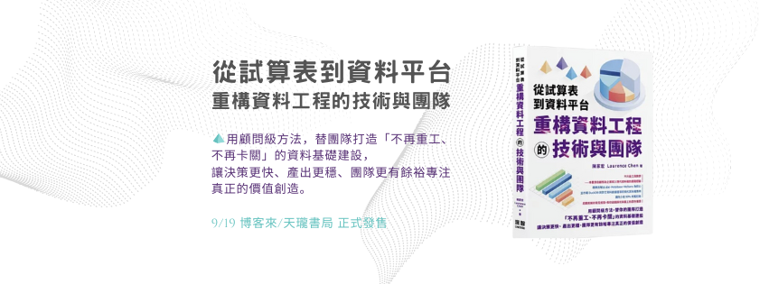
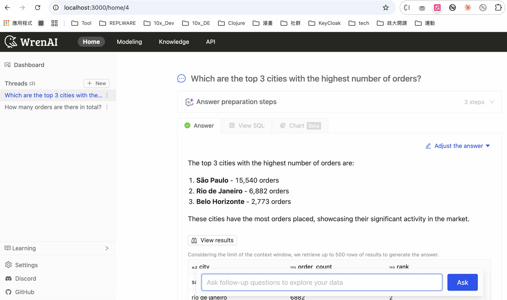

<!-- _class: lead -->

# GenBI

**BI 報表的最後一哩路**

---

## Laurence Chen / 陳家宏

- Clojure、dbt-Taipei 線下活動主辦人
- IT 顧問、講者、作家
- 《從試算表到資料平台－重構資料工程的技術與團隊》

---

## Agenda

* BI 報表的最後一哩路
* LLM && GenBI
* Security Issues
* Cost Issues

---

## BI 報表的最後一哩路

假設你的公司已經有了 (數據中台) **Modern Data Stack**，資料倉儲的資料已整理好了。

但是，你的 user 告訴你：

- 😕 **「很難用，因為我不會寫 SQL」**
- 🐌 **「很難用，有一些複雜的需求，不知如何表達」**

---

## 解法的矛盾

**BI Visualization Layer**
- Application 生成 SQL
- 彈性有限

**Pure SQL**
- 幾乎可以處理 95% 的問題
- 一般 user 不會寫

---

## 用 LLM 來生成 SQL

用 LLM 來理解三件事：

1. 理解 **Ontology**（資料語意）
2. 理解 **User Intention**（使用者意圖）
3. **翻譯** Intention → Query

---

## Wren AI

---

## Security Issues

> 公司資料庫裡的資料會不會外流到 LLM provider？

- 只傳送 **Ontology（結構定義）**，不傳原始資料
- 可搭配 private/local LLM 方案

---

## Cost Issues

> 會不會跑一跑，LLM 的帳單就幾十萬？

- **Text-to-SQL** 算是非常有效率的應用
- 每次查詢只需少量 token

---
## Primary Concerns

- 是否與 BI view layer 整合？Metabase 有 Metabot
- 產生的 SQL 查詢準不準？
- 權限管控？